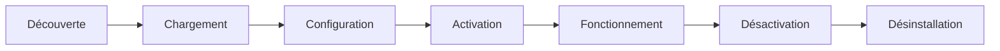

# Gestion des Fonctionnalités - Cobra AI Features

## 🎯 Vue d'ensemble

Le système de gestion des fonctionnalités de Cobra AI Features permet d'activer, désactiver et configurer individuellement chaque module du plugin. Cette architecture modulaire garantit flexibilité et performance.

## 🏗️ Architecture Modulaire

### Principe de Fonctionnement

Chaque fonctionnalité est un module autonome qui :
- **Hérite de `FeatureBase`** : Structure standardisée
- **Définit ses propres tables** : Isolation des données
- **Gère sa configuration** : Paramètres indépendants
- **Expose ses propres APIs** : Endpoints dédiés
- **Maintient sa documentation** : Fichier `help.html`

### Cycle de Vie d'une Fonctionnalité



## 📁 Structure des Fonctionnalités

### Arborescence Standard

```
features/
├── ai/                           # Fonctionnalité IA
│   ├── Feature.php              # Classe principale
│   ├── includes/                # Classes helper
│   │   ├── AIAdmin.php         # Interface admin
│   │   ├── AIManager.php       # Gestionnaire
│   │   ├── AITracking.php      # Suivi
│   │   └── Providers/          # Fournisseurs IA
│   ├── assets/                 # Ressources
│   │   ├── css/
│   │   ├── js/
│   │   └── help.html           # Documentation
│   └── views/                  # Templates admin
│       └── settings.php
├── credits/                     # Système de crédits
├── contact/                     # Formulaire contact
└── ...                         # Autres fonctionnalités
```

### Convention de Nommage

| Type | Convention | Exemple |
|------|------------|---------|
| **Dossier** | kebab-case | `stripe-subscriptions` |
| **Classe** | PascalCase | `StripeSubscriptions` |
| **Namespace** | PascalCase | `CobraAI\Features\StripeSubscriptions` |
| **ID** | kebab-case | `stripe-subscriptions` |
| **Table DB** | snake_case | `cobra_stripe_subscriptions` |

## 🔄 Découverte et Chargement

### Découverte Automatique

Le plugin découvre automatiquement les fonctionnalités :

```php
public function get_features(bool $include_inactive = true): array
{
    $feature_dirs = glob(COBRA_AI_FEATURES_DIR . '*', GLOB_ONLYDIR);
    $active_features = get_option('cobra_ai_enabled_features', []);
    
    foreach ($feature_dirs as $dir) {
        $feature_id = basename($dir);
        
        // Charger seulement si actif (ou si demandé)
        if ($include_inactive || in_array($feature_id, $active_features)) {
            $feature = $this->get_feature($feature_id);
            if ($feature) {
                $this->container['features'][$feature_id] = $feature;
            }
        }
    }
    
    return $this->container['features'];
}
```

### Chargement Conditionnel

```php
private function load_feature(string $feature_id): void
{
    // Conversion kebab-case vers PascalCase
    $namespace = str_replace(' ', '', ucwords(str_replace('-', ' ', $feature_id)));
    $class_name = 'CobraAI\\Features\\' . $namespace . '\\Feature';
    
    $feature_dir = COBRA_AI_FEATURES_DIR . $feature_id;
    $class_file = $feature_dir . '/Feature.php';
    
    if (!is_dir($feature_dir) || !file_exists($class_file)) {
        throw new \Exception("Feature not found: {$class_file}");
    }
    
    require_once $class_file;
    
    if (class_exists($class_name)) {
        $feature = new $class_name();
        $this->container['features'][$feature_id] = $feature;
        
        if (method_exists($feature, 'init') && $feature->is_feature_active($feature_id)) {
            $feature->init();
        }
    }
}
```

## ⚙️ Gestion des États

### États des Fonctionnalités

| État | Description | Action Possible |
|------|-------------|-----------------|
| **Découvert** | Trouvé mais non activé | Activer |
| **Actif** | Chargé et fonctionnel | Désactiver, Configurer |
| **Inactif** | Présent mais désactivé | Activer, Supprimer |
| **Erreur** | Problème de chargement | Debugger, Réinstaller |

### Persistance des États

```php
// Option WordPress stockant les fonctionnalités actives
$active_features = get_option('cobra_ai_enabled_features', []);

// Exemple de contenu
$active_features = [
    'ai',
    'credits', 
    'contact',
    'stripe'
];
```

### Registre des Fonctionnalités

Table `cobra_features` pour tracking avancé :

```sql
CREATE TABLE cobra_features (
    id varchar(50) NOT NULL,
    name varchar(100) NOT NULL,
    version varchar(20) NOT NULL,
    status enum('active','inactive','error') NOT NULL DEFAULT 'inactive',
    installed_at datetime NOT NULL DEFAULT CURRENT_TIMESTAMP,
    settings longtext,
    PRIMARY KEY (id)
);
```

## 🔧 Interface d'Administration

### Page de Gestion

L'interface `Cobra AI → Fonctionnalités` permet :

#### Vue Liste
```php
foreach ($features as $feature_id => $feature) {
    $info = $feature->get_info();
    $is_active = in_array($feature_id, $active_features);
    
    echo '<tr>';
    echo '<td>' . esc_html($info['name']) . '</td>';
    echo '<td>' . esc_html($info['description']) . '</td>';
    echo '<td>' . ($is_active ? 'Actif' : 'Inactif') . '</td>';
    echo '<td>';
    
    if ($is_active) {
        echo '<a href="' . $this->get_deactivate_url($feature_id) . '">Désactiver</a>';
        if ($feature->has_settings()) {
            echo ' | <a href="' . $this->get_settings_url($feature_id) . '">Configurer</a>';
        }
    } else {
        echo '<a href="' . $this->get_activate_url($feature_id) . '">Activer</a>';
    }
    
    echo '</td>';
    echo '</tr>';
}
```

#### Actions Disponibles

```php
// Activation
public function activate_feature(string $feature_id): bool
{
    try {
        $feature = $this->get_feature($feature_id);
        if (!$feature) {
            throw new \Exception("Feature not found: $feature_id");
        }
        
        // Vérifier les dépendances
        $this->check_dependencies($feature);
        
        // Activer la fonctionnalité
        if ($feature->activate()) {
            $active_features = get_option('cobra_ai_enabled_features', []);
            $active_features[] = $feature_id;
            update_option('cobra_ai_enabled_features', array_unique($active_features));
            
            return true;
        }
        
        return false;
        
    } catch (\Exception $e) {
        $this->add_admin_error($e->getMessage());
        return false;
    }
}

// Désactivation
public function deactivate_feature(string $feature_id): bool
{
    try {
        $feature = $this->get_feature($feature_id);
        if ($feature && $feature->deactivate()) {
            $active_features = get_option('cobra_ai_enabled_features', []);
            $active_features = array_diff($active_features, [$feature_id]);
            update_option('cobra_ai_enabled_features', $active_features);
            
            return true;
        }
        
        return false;
        
    } catch (\Exception $e) {
        $this->add_admin_error($e->getMessage());
        return false;
    }
}
```

## 📊 Gestion des Dépendances

### Déclaration des Dépendances

Dans la classe Feature :

```php
class Feature extends FeatureBase
{
    protected $requires = ['credits', 'stripe']; // Dépendances requises
    
    public function check_dependencies(): bool
    {
        if (empty($this->requires)) {
            return true;
        }
        
        $active_features = get_option('cobra_ai_enabled_features', []);
        
        foreach ($this->requires as $required_feature) {
            if (!in_array($required_feature, $active_features)) {
                $this->add_admin_notice(
                    sprintf(
                        __('The %1$s feature requires the %2$s feature to be active.', 'cobra-ai'),
                        $this->name,
                        $required_feature
                    ),
                    'error'
                );
                return false;
            }
        }
        
        return true;
    }
}
```

### Résolution des Dépendances

```php
private function resolve_dependencies(array $features_to_activate): array
{
    $resolved = [];
    $visiting = [];
    
    foreach ($features_to_activate as $feature_id) {
        $this->resolve_dependency($feature_id, $resolved, $visiting);
    }
    
    return $resolved;
}

private function resolve_dependency(string $feature_id, array &$resolved, array &$visiting): void
{
    if (in_array($feature_id, $resolved)) {
        return; // Déjà résolu
    }
    
    if (in_array($feature_id, $visiting)) {
        throw new \Exception("Circular dependency detected: $feature_id");
    }
    
    $visiting[] = $feature_id;
    
    $feature = $this->get_feature($feature_id);
    if ($feature) {
        $info = $feature->get_info();
        
        // Résoudre les dépendances d'abord
        foreach ($info['requires'] as $dependency) {
            $this->resolve_dependency($dependency, $resolved, $visiting);
        }
    }
    
    $resolved[] = $feature_id;
    $visiting = array_diff($visiting, [$feature_id]);
}
```

## 🏥 Health Checks

### Vérification de Santé

Chaque fonctionnalité peut implémenter sa propre vérification :

```php
public function get_health_status(): array
{
    $status = [
        'status' => 'healthy',
        'message' => '',
        'warnings' => [],
        'checks' => [
            'dependencies' => $this->check_dependencies(),
            'system' => $this->check_requirements(),
            'database' => $this->check_tables(),
            'files' => $this->check_files(),
        ]
    ];
    
    // Vérifications personnalisées
    $custom_checks = $this->get_custom_health_checks();
    if (!empty($custom_checks)) {
        $status = array_merge($status, $custom_checks);
    }
    
    // Déterminer le statut global
    if (in_array(false, $status['checks'])) {
        $status['status'] = 'warning';
        $status['message'] = 'Some checks failed';
    }
    
    return $status;
}
```

### Dashboard de Santé

```php
public function render_health_dashboard(): void
{
    $features = $this->get_features(true);
    
    echo '<div class="health-dashboard">';
    
    foreach ($features as $feature_id => $feature) {
        $health = $feature->get_health_status();
        $status_class = 'status-' . $health['status'];
        
        echo "<div class='feature-health-card {$status_class}'>";
        echo "<h3>" . esc_html($feature->get_info()['name']) . "</h3>";
        echo "<div class='status'>" . esc_html($health['message']) . "</div>";
        
        if (!empty($health['warnings'])) {
            echo "<ul class='warnings'>";
            foreach ($health['warnings'] as $warning) {
                echo "<li>" . esc_html($warning) . "</li>";
            }
            echo "</ul>";
        }
        
        echo "</div>";
    }
    
    echo '</div>';
}
```

## 🔄 Mise à Jour et Migration

### Gestion des Versions

```php
public function check_feature_versions(): void
{
    $features = $this->get_features(true);
    
    foreach ($features as $feature_id => $feature) {
        $current_version = $feature->get_info()['version'];
        $stored_version = get_option("cobra_ai_{$feature_id}_version", '0.0.0');
        
        if (version_compare($current_version, $stored_version, '>')) {
            $this->upgrade_feature($feature_id, $stored_version, $current_version);
        }
    }
}

private function upgrade_feature(string $feature_id, string $from, string $to): bool
{
    try {
        $feature = $this->get_feature($feature_id);
        
        // Migrations de base de données
        if (method_exists($feature, 'migrate')) {
            $feature->migrate($from, $to);
        }
        
        // Mise à jour des options
        if (method_exists($feature, 'upgrade_settings')) {
            $feature->upgrade_settings($from, $to);
        }
        
        // Mettre à jour la version stockée
        update_option("cobra_ai_{$feature_id}_version", $to);
        
        return true;
        
    } catch (\Exception $e) {
        cobra_ai_db()->log('error', "Feature upgrade failed: $feature_id", [
            'from' => $from,
            'to' => $to,
            'error' => $e->getMessage()
        ]);
        
        return false;
    }
}
```

## 📦 Installation/Désinstallation

### Installation Complète

```php
public function install_feature(string $feature_id): bool
{
    try {
        $feature = $this->get_feature($feature_id);
        
        // 1. Vérifier les prérequis
        if (!$feature->check_requirements()) {
            throw new \Exception('System requirements not met');
        }
        
        // 2. Installer les tables
        if (!empty($feature->get_tables())) {
            cobra_ai_db()->register_feature_tables($feature_id, $feature->get_tables());
            cobra_ai_db()->install_feature_tables($feature_id);
        }
        
        // 3. Activer la fonctionnalité
        if ($feature->activate()) {
            $this->add_active_feature($feature_id);
            return true;
        }
        
        return false;
        
    } catch (\Exception $e) {
        $this->rollback_installation($feature_id);
        throw $e;
    }
}
```

### Désinstallation Propre

```php
public function uninstall_feature(string $feature_id, bool $preserve_data = false): bool
{
    try {
        $feature = $this->get_feature($feature_id);
        
        // 1. Désactiver d'abord
        $this->deactivate_feature($feature_id);
        
        // 2. Nettoyer les données (si demandé)
        if (!$preserve_data && $feature) {
            $feature->uninstall();
        }
        
        // 3. Supprimer de la liste
        $this->remove_active_feature($feature_id);
        
        return true;
        
    } catch (\Exception $e) {
        cobra_ai_db()->log('error', "Feature uninstall failed: $feature_id", [
            'error' => $e->getMessage()
        ]);
        
        return false;
    }
}
```

## 🚀 Optimisation des Performances

### Chargement Lazy

```php
// Ne charger que les fonctionnalités nécessaires
public function init_features(): void
{
    // En admin : charger toutes pour la gestion
    if (is_admin()) {
        $this->load_admin_features();
    } 
    // En frontend : seulement les actives
    else {
        $this->load_active_features();
    }
}

private function load_active_features(): void
{
    $active_features = get_option('cobra_ai_enabled_features', []);
    
    foreach ($active_features as $feature_id) {
        // Chargement conditionnel selon le contexte
        if ($this->should_load_feature($feature_id)) {
            $this->load_feature($feature_id);
        }
    }
}
```

### Cache des Métadonnées

```php
private function cache_feature_metadata(): void
{
    $cache_key = 'cobra_ai_feature_metadata';
    $metadata = wp_cache_get($cache_key);
    
    if (false === $metadata) {
        $metadata = [];
        $features = $this->get_features(true);
        
        foreach ($features as $feature_id => $feature) {
            $metadata[$feature_id] = $feature->get_info();
        }
        
        wp_cache_set($cache_key, $metadata, '', HOUR_IN_SECONDS);
    }
    
    return $metadata;
}
```

Cette gestion modulaire des fonctionnalités garantit flexibilité, maintenabilité et performance pour l'écosystème Cobra AI Features.